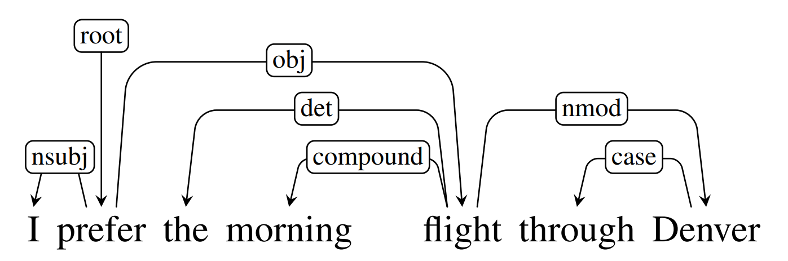
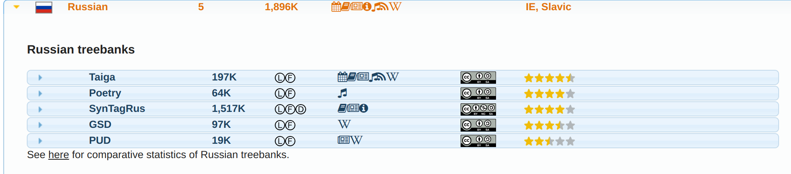

Introduction to UD format
=========================

.. contents:: Content:
   :depth: 2

Universal dependencies
----------------------

**Universal Dependencies (UD)** is a project that is developing
cross-linguistically consistent treebank annotation for many languages.

.. note:: **Treebank** is a database of sentences which are annotated with
          syntactic information, often in the form of a tree.

In universal dependencies paradigm, a language is represented as a
graph, meaning that all words are related to each other in a some
hierarchical form, and that is what dependency grammar is about.

In such terms, a syntactic structure of a sentence is decoded using
solely words and **directed binary grammatical relations**. The
relations in a dependency structure capture the head-dependent
relationship among the words in a sentence

CoNLL-U annotation
------------------

**CoNLL-U** (Conference on Natural Language Learning - Universal
Dependencies) format is a specific file format for representing
syntactic annotations in the Universal Dependencies framework.

It describes both syntactic and morphological features for each word.

Here is an excerpt from the official description:

    Sentences consist of one or more word lines, and word lines contain
    the following fields:

    -  **ID**: Word index, integer starting at 1 for each new sentence;
    -  **FORM**: Word form or punctuation symbol;
    -  **LEMMA**: Lemma or stem of word form;
    -  **UPOS**: Universal part-of-speech tag;
    -  **XPOS**: Optional language-specific (or treebank-specific)
       part-of-speech / morphological tag; underscore if not available;
    -  **FEATS**: List of morphological features from the universal feature
       inventory or from a defined language-specific extension; underscore
       if not available;
    -  **HEAD**: Head of the current word, which is either a value of ID or
       zero (0);
    -  **DEPREL**: Universal dependency relation to the HEAD (root if HEAD
       = 0) or a defined language-specific subtype of one;
    -  **DEPS**: Enhanced dependency graph in the form of a list of
       head-deprel pairs;
    -  **MISC**: Any other annotation.

So, for the following text *“Медведь спит под деревом.”* the annotated
file will look like this:

.. code:: text

   # text = Медведь спит под деревом.
   1   Медведь    медведь   NOUN    _   Animacy=Anim|Case=Nom|Gender=Masc|Number=Sing   0   ROOT    _   _
   2   спит    спать   VERB    _   Aspect=Imp|Mood=Ind|Number=Sing|Person=3|Tense=Pres|VerbForm=Fin   1   acl:relcl   _   _
   3   под под ADP _   _   _   4   case    _   _
   4   деревом дерево  NOUN    _   Animacy=Inan|Case=Ins|Gender=Neut|Number=Sing    2   obl _   SpaceAfter=No
   5   .   .   PUNCT   _   _   1   punct   _   _

Here, each line corresponds to a word/token in the sentence and columns
represent various annotations for each word/token.

The first column is the word index, the second column is the word form,
the third column is the lemma (base form) of the word, the fourth column
is the part-of-speech (POS) tag.

Other columns may represent additional morphological features, syntactic
dependencies, and so on.

UDPipe
------

UDPipe is a trainable pipeline for tokenization, tagging, lemmatization
and dependency parsing of CoNLL-U files. UDPipe is language-agnostic and
can be trained given annotated data in CoNLL-U format.

So, the obtained CoNLL-U annotation might be different depending on the
UDPipe model used to process text. As of now, there are 5 models trained
on the Russian language treebanks.

To view more details about the models and examine statistics refer to
the `official UD website <https://universaldependencies.org/>`__.

In our work, we will be using pre-downloaded UDPipe model based on
`SynTagRus
treebank <https://universaldependencies.org/treebanks/ru_syntagrus/index.html>`__.
You can find it
`here <https://github.com/fipl-hse/2023-2-level-ctlr/blob/main/core_utils/udpipe
/russian-syntagrus-ud-2.0-170801.udpipe>`__.

Python frameworks
-----------------

There are numerous frameworks that allow working with UDPipe models via
Python.

The very first one is the `official UDPipe
library <https://github.com/ufal/udpipe>`__ from Institute of Formal and
Applied Linguistics. However, due to its low-level implementation and
lack of documentation, in our work we will be working with the
`spacy-udpipe <https://spacy.io/universe/project/spacy-udpipe>`__
library, which is a friendlier wrapper over the original ``udpipe``
module that allows combining ``spacy`` interface with UD parsing
solutions.

More information
----------------

-  `Lecture from Stanford university on Universal
   Dependencies <https://web.stanford.edu/~jurafsky/slp3/18.pdf>`__
-  `CoNLL-U format
   description <https://universaldependencies.org/format.html>`__
