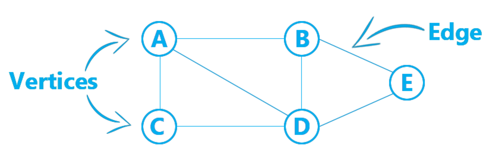
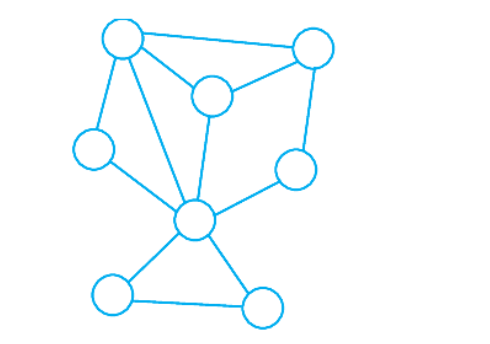
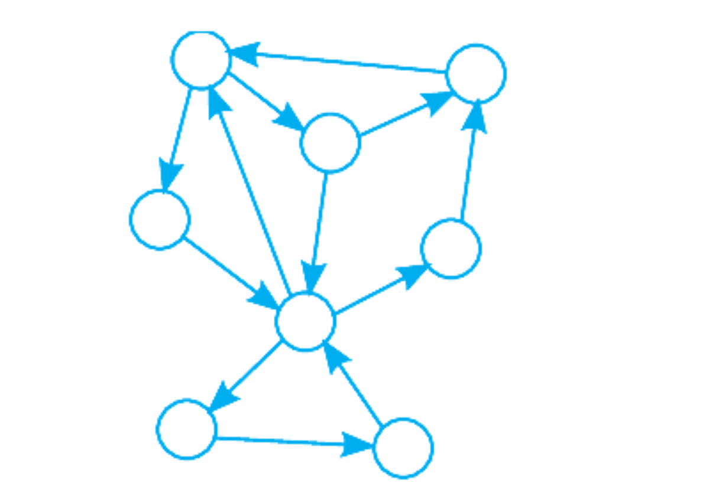
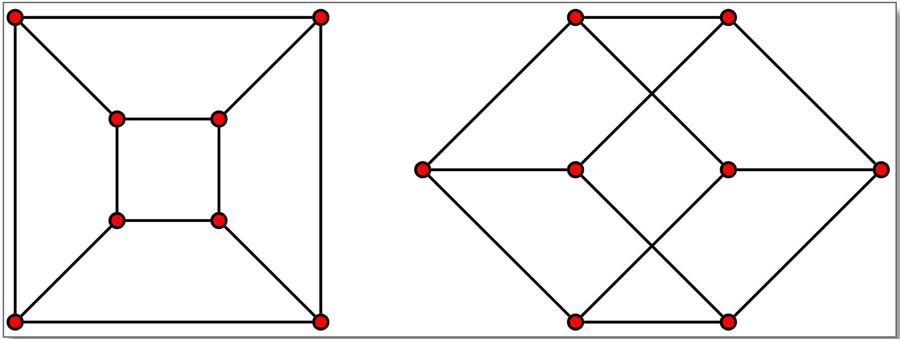

Introduction to graph data structure
====================================

.. contents:: Content:
   :depth: 2

Definition
----------

**Graph** is a non-linear data structure consisting of vertices and edges.
The vertices are sometimes also referred to as
nodes and the edges are lines or arcs that connect any two nodes in the graph.

.. note:: Formally a Graph is composed of a set of vertices (V)
          and a set of edges (E). The graph is thus denoted by G(V, E).

Two edges are said to be **incident** if they share a common vertex.
A vertex is **incident** with an edge if the vertex is one of the endpoints of that edge.

Types of graphs
----------------

**Undirected graph** is graph in which edges do not have a direction.
In other words, the edge connecting vertex A to vertex B is the same
as the edge connecting vertex B to vertex A.

Alternatively, in the **directed graph** edges do have direction.
So, the edge connecting vertex A to vertex B
is different from the edge connecting vertex B to vertex A.

Graph traversal
---------------

**Graph traversal** is the process of visiting each node in a tree exactly once in a specific order.

.. figure:: ../images/graph_traversal.png
   :alt: graph_traversal

Graph isomorphism
-----------------

Two graphs G and G' are isomorphic if there is a one to one
correspondence between their vertices and
between their edges such that the incidence relationship is preserved.

