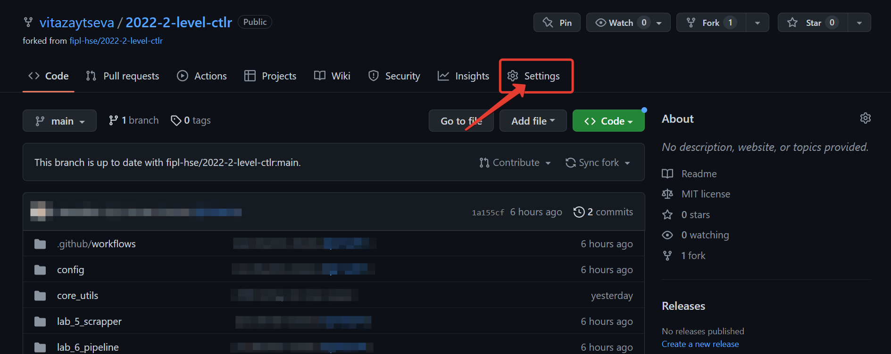
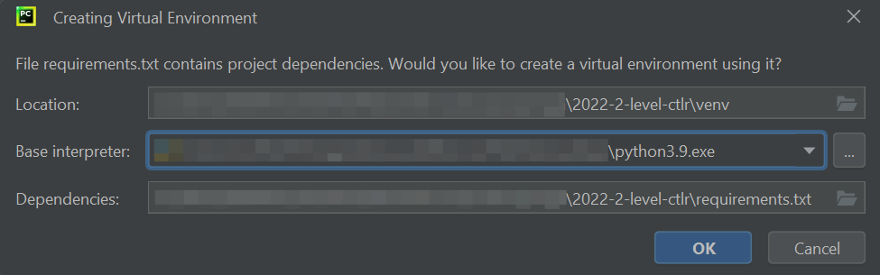

.. _starting-guide-en-label:

Starting guide
==============

Before starting the “Computer Tools for Linguistic Research” course,
each student needs to take a few steps that will prepare the necessary
tools for further work.

.. contents:: Content:
   :depth: 2

Check you have everything you need
----------------------------------

We assume that after completing the **“Programming for Linguists”**
course, you have:

-  Python interpreter
-  Git version control system
-  PyCharm development environment
-  GitHub account

If you do not have any of these, go back to steps 1-5 from `Подготовка к прохождению курса
<https://github.com/fipl-hse/2023-2-level-labs/blob/main/docs/public/starting_guide_ru.rst>`__.

Fork the repository
-------------------

To fork a repository on the Github, follow these steps:

1. Open the repository site that your lecturer has sent you.
2. In the upper right corner click ``Fork``.

   .. figure:: ../images/starting_guide/github_forking_1.png
      :alt: forking_1

3. Click ``Create Fork``.

   .. figure:: ../images/starting_guide/github_forking_2.png
      :alt: forking_2

You have forked a repository! Pay attention to the link in the address
bar of the browser: it should contain your Github username and the name
of the repository: ``https://github.com/<your-username>/202X-2-level-ctlr``.

Add collaborators
-----------------

Only you can make changes to your fork. However, during the course,
`Dmitry Uraev <https://github.com/dmitry-uraev>`__ and `Marina
Kazyulina <https://github.com/marina-kaz>`__ will need to make changes
to your fork: add changes from the main fork, resolve conflicts, etc.
You should add them to **collaborators**, so they have such an
opportunity.

To do this, follow these steps:

1. Open the fork site you created in the `Fork the repository <#creating-fork>`__ step.

   1. **NB**: Pay attention to the link in the address bar of the browser:
      it should contain your Github username and the name of the repository.

2. Click ``Settings``.

3. Select ``Collaborators`` from the left menu.

   .. figure:: ../images/starting_guide/github_collaborators_tub.png
      :alt: add collaborator tub

4. Click ``Add people``.

   .. figure:: ../images/starting_guide/github_add_collaborator.png
      :alt: add collaborator

5. Enter `Dmitry Uraev <https://github.com/dmitry-uraev>`__ and `Marina
   Kazyulina <https://github.com/marina-kaz>`__ GitHub username, select
   it from the list, and click
   ``Add <github-username> to this repository``.

   .. figure:: ../images/starting_guide/github_add_collaborator_finish.png
      :alt: add collaborator finish

You have sent `Dmitry Uraev <https://github.com/dmitry-uraev>`__ and
`Marina Kazyulina <https://github.com/marina-kaz>`__ a request to be
added to the collaborators! Write to them so they can accept your
request.

Clone a fork of the repository to work locally
----------------------------------------------

To clone a fork to work locally, follow these steps:

1. Open your fork’s website.
2. Click ``Code``, select ``HTTPS`` and click the copy button.

   .. figure:: ../images/starting_guide/cloning_repository.png
      :alt: cloning repository

3. Open a terminal and navigate to a convenient folder.

   1. To move from folder to folder in the terminal, use the command
      ``cd <folder-name>``
   2. If you do not know how to open a terminal,
      go to the `Open a terminal`_ step.

4. Run ``git clone <link-to-your-fork>`` to clone the repository. For
   example,
   ``git clone https://github.com/vitazaytseva/2022-2-level-ctlr.git``.

   1. **NB**: If asked for a password, enter your **Personal Access
      Token**.

Create a project in PyCharm development environment
---------------------------------------------------

To create a project in the PyCharm development environment to work with
your fork, follow these steps:

1. Open PyCharm and click ``Open``.

   .. figure:: ../images/starting_guide/openning_project.png
      :alt: openning project

2. Select the folder with the fork that you cloned in the `Clone a fork
   of the repository to work locally`_ step and click ``Open``.

   1. **NB**: You need to select the folder with the fork called
      ``202X-2-level-ctlr``, not the folder with a specific lab.

3. Click ``OK``.

   1. **NB**: If in the ``Base Interpreter`` field the Python version is
      < 3.10, then click ``Python 3.X`` and select a newer version from
      the drop-down list.

You have created a project!

Modify source code and push changes to remote fork
--------------------------------------------------

You will work on different files in each lab folder.
The process looks like this:

1. You change the source code in the file.
2. You commit changes using the ``git`` version control system.
3. You push changes to a remote fork.

.. _changing-code:

Change the source code
~~~~~~~~~~~~~~~~~~~~~~

By default, functions do not have implementations - only ``pass`` in the
function body. Your task is to implement functions according to the
provided lab description.

.. _committing-changes:

Commit changes
~~~~~~~~~~~~~~

**Git** is a version control system that allows developers to save and
track changes to project files at once.

To commit the changes, follow these steps:

1. Open a terminal in the PyCharm development environment.

   .. figure:: ../images/starting_guide/pycharm_open_terminal.png
      :alt: pycharm open terminal

2. Run ``git add <path-to-file-with-changes>``. For example,
   ``git add lab_5_scrapper/scrapper.py``.

3. Run ``git commit -m "message"``.

   1. **NB**: It is recommended to use a brief description of the
      changes you made as ``message``. This text will be public.

.. _pushing-changes:

Push changes to remote fork
~~~~~~~~~~~~~~~~~~~~~~~~~~~

After the previous step the changes are in a committed state. They are
stored only in your system. To send them to a remote fork, follow these
steps:

1. Open a terminal in the PyCharm development environment.

   .. figure:: ../images/starting_guide/pycharm_open_terminal.png
      :alt: open_terminal

2. Run ``git pull``.

   1. **NB**: If asked for a password, enter your **Personal Access
      Token**.

3. Run ``git push``.

   1. **NB**: If asked for a password, enter your **Personal Access
      Token**.

4. Open the main page of your remote fork.

   1. **NB**: You will see the *commit* and the *message* you wrote.

More information about the commands described above can be found in `the
official Git documentation <https://git-scm.com/docs>`__.

Create a Pull Request
---------------------

You need to create a Pull Request on GitHub, so mentors can review your
changes and validate. To do this, follow these steps:

1. Open the repository site that your lecturer sent you.

2. Select ``Pull Requests``.

   .. figure:: ../images/starting_guide/github_pull_request_highlighted.png
      :alt: pull_request_highlighted

3. Click ``New pull request``.

   .. figure:: ../images/starting_guide/github_new_pull_request.png
      :alt: new_pull_request

4. Click ``compare across forks``.

   .. figure:: ../images/starting_guide/github_compare_across_forks.png
      :alt: compare_across_forks

5. Click ``head repository`` and select your fork from the list (it
   contains your GitHub username).

   .. figure:: ../images/starting_guide/github_choose_fork.png
      :alt: choose_fork

6. Click ``Create pull request``.

   .. figure:: ../images/starting_guide/github_create_pull_request_final_step.png
      :alt: create_pull_request

7. Enter a name for the Pull Request.

   1. **NB**: The Pull Request name for **Lab 5** must match the
      pattern: ``Scrapper, Name Surname - 2XFPLX``.

   2. **NB**: The Pull Request name for **Lab 6** must match the
      pattern: ``Pipeline, Name Surname - 2XFPLX``.

      .. figure:: ../images/starting_guide/github_name_pull_request.png
         :alt: name pull request

8. Click ``Assignees`` and select your mentor from the list.

   1. **NB**: You can find your mentor in **the progress sheet**.

      .. figure:: ../images/starting_guide/github_assignees.png
         :alt: assignees

9. Click ``Create pull request``.

   1. **NB**: Your Pull Request will appear in the Pull Requests.

Continue working
----------------

Your work consists in repeating the following steps:

1. :ref:`You change the source code <changing-code>`.
2. :ref:`You commit the changes <committing-changes>`.
3. :ref:`You push changes to a remote fork <pushing-changes>`.

   1. They will automatically be updated in the Pull Request you
      created.

4. The mentor reviews your code and leaves comments.
5. You correct the source code according to the comments.
6. See step #2.

Open a terminal
---------------

-  `Instruction for
   Windows <https://docs.microsoft.com/ru-ru/powershell/scripting/windows-powershell/starting-windows-powershell?view=powershell-7.2>`__
-  `Instruction for
   macOS <https://support.apple.com/ru-ru/guide/terminal/apd5265185d-f365-44cb-8b09-71a064a42125/mac>`__
