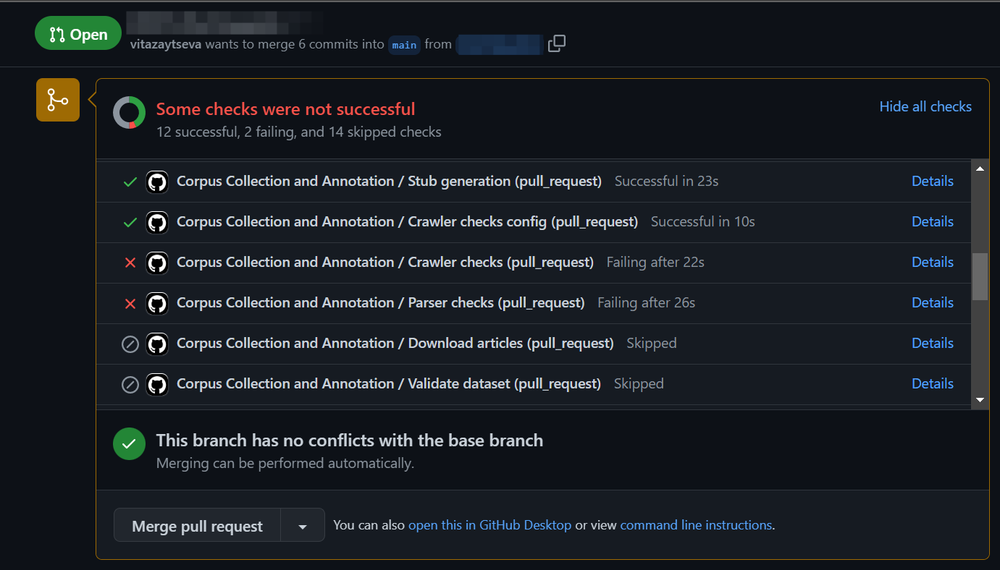
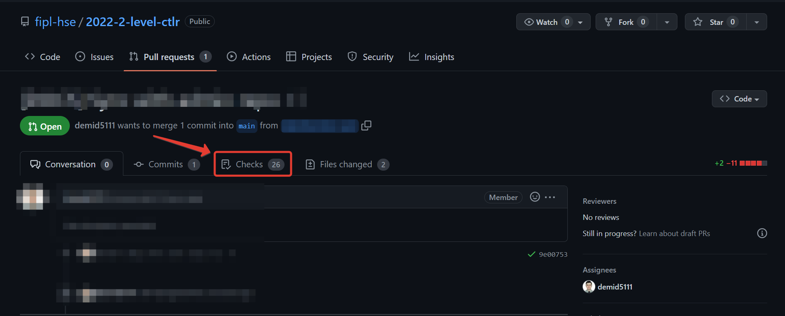

.. _ctlr-tests-label:

Working with tests: locally and in CI
=====================================

.. contents:: Content:
   :depth: 2

Running tests locally
---------------------

Before pushing your changes to a remote fork, you will want to check
that your code is working correctly. To do this, you can run tests
locally.

.. hint:: If you extract articles URLs from dynamic site, make sure you use
          ``selenium.webdriver.Chrome`` and have ``headless mode`` enabled.

To run tests locally, you need to perform several steps in PyCharm:

1. Install tests dependencies (ensure you have activated your
   environment if you have such by running ``.\venv\Scripts\activate``):

   .. code:: bash

      python -m pip install -r requirements_qa.txt

2. Create a new configuration:

   .. figure:: ../images/tests/pycharm_create_configuration.jpg
      :alt: create configuration

3. Choose ``pytest`` as a target:

   .. figure:: ../images/tests/pycharm_choose_pytest_template.jpg
      :alt: choose pytest template

4. Fill ``pytest`` configuration and click ``OK``:

   .. figure:: ../images/tests/pycharm_fill_pytest_configuration.jpg
      :alt: fill pytest configuration

5. Run ``pytest`` configuration:

   .. figure:: ../images/tests/pycharm_run_pytest.jpg
      :alt: run pytest

   This should run all the tests in the repository. You can inspect them
   by clicking through a list at the bottom of a screen.

   .. figure:: ../images/tests/pycharm_tests_report.png
      :alt: tests report

6. As you have some tests failing, you want to debug them. Then, first,
   you need to limit a scope of running tests and the mark level you
   want to get for an assignment. For example, you might want to run
   checks for a crawler configuration. Then you need to return to
   configuration menu and pass additional parameters, like
   ``-m stage_2_1_crawler_config_check``.

   .. figure:: ../images/tests/pycharm_control_tests_scope.jpg
      :alt: control tests scope

   You can choose any of the labels that are described in
   ``pyproject.toml`` file and combine with a mark.
   For example, running the aforementioned check for configuration
   for a mark 8 will look like
   ``-m "mark8 and stage_2_1_crawler_config_check"``.

.. hint:: To running all tests for first assignment for mark 8:
          ``-m "mark8 and (stage_2_1_crawler_config_check or
          stage_2_2_crawler_check or stage_2_3_HTML_parser_check or
          stage_2_4_dataset_volume_check or stage_2_5_dataset_validation)"``

.. hint:: When you want to debug a test, instead of running them, put
          a breakpoint at the potentially vulnerable place of code and execute
          debugging by clicking a ‘bug’ button.

Running tests in CI
-------------------

Tests will never run until you create a Pull Request.

The very first check happens exactly when you create a Pull Request.
After that, each time you push changes in your fork, CI check will be
automatically started, normally within a minute or two. To see the
results, navigate to your PR and click either the particular step in the
report at the end of a page, or click **Checks** in the toolbar.

Inspect each step by clicking through the list to the left.

CI stages
---------

1. Stage 1. Style

   1. Stage 1.1. PR Name
   2. Stage 1.2. Code style (``pylint``, ``flake8``)

2. Stage 2. Crawler

   1. Stage 2.1. Crawler config validation (we ensure that crawler has
      certain sanity checks)
   2. Stage 2.2. ``Crawler`` instantiation validation
   3. Stage 2.3. ``Parser`` instantiation validation
   4. Stage 2.4. Articles downloading
   5. Stage 2.5. Dataset volume validation
   6. Stage 2.6. Dataset structure validation

3. Stage 3. Text Processing Pipeline

   1. Stage 3.1. Dataset sanity checks (we ensure that pipeline has
      certain sanity checks)
   2. Stage 3.2. ``CorpusManager`` sanity checks (we ensure that
      pipeline identifies all articles correctly)
   3. Stage 3.3. ``MorphologicalToken`` sanity checks (we ensure that
      pipeline displays all tokens appropriately)
   4. Stage 3.4. Admin data processing
   5. Stage 3.5. Student dataset processing
   6. Stage 3.6. Student dataset validation

4. Stage 4. Additional tasks

   1. stage 4.1. ``POSFrequencyPipeline`` checks
   2. Stage 4.2. Frequency visualization
