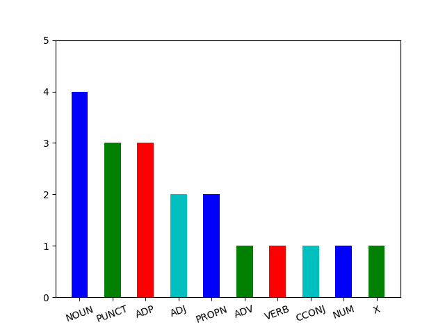

.. _pipeline-label:

Laboratory work №6. Process raw data
====================================

.. toctree::
    :maxdepth: 1
    :titlesonly:
    :caption: Full API

    lab_6_pipeline.api.rst

Python competencies required to complete this tutorial:

   -  working with external dependencies, going beyond Python standard
      library;
   -  working with external modules: local and downloaded from PyPi;
   -  working with files: create/read/update;
   -  applying basic cleaning techniques to the raw text: tokenization,
      lemmatization etc.;
   -  extracting linguistic features from the raw text: part of speech,
      case etc.
   -  collecting statistics from text: POS frequency,
      grammar structures extraction etc.

Processing data breaks down in the following steps:

1. Loading raw data.
2. Cleaning the text.
3. Extracting valuable information from the text such as parts of speech, lemmas,
   syntactic positions etc.
4. Saving extracted information in the specified format.
5. Aggregating saved linguistic information to answer questions about data.

As a part of the second milestone, you need to implement processing
logic as a ``pipeline.py`` module. When it is run as a standalone Python
program, it should perform all aforementioned stages.

During this assignment you will be working with the UD text description
format (``.conllu`` extension).

.. note:: UD (Universal Dependencies) is a framework for consistent
          annotation of grammar (parts of speech, morphological features, and
          syntactic dependencies) across different human languages. All this
          annotation is usually stored in a format called ``CONLL-U``, that is
          a vertical, table-like format. More information about the structure
          of the ``CONLL-U`` format is available on the `dedicated
          page <https://universaldependencies.org/format.html>`__.

Executing pipeline
------------------

Example execution (``Windows``):

.. code:: bash

   python pipeline.py

Expected result:

1. ``N`` raw texts previously collected by scrapper are processed.
2. Each article has a processed version (or versions) saved
   in the ``tmp/articles`` directory.

An example ``tmp`` directory content for mark 4:

.. code:: text

   +-- 2023-2-level-ctlr
       +-- tmp
           +-- articles
               +-- 1_raw.txt <- the paper with the ID (from scrapper.py run)
               +-- 1_meta.json <- the paper meta-information (from scrapper.py run)
               +-- 1_cleaned.txt <- processed text with no punctuation (by pipeline.py run)

An example ``tmp`` directory content for mark 6:

.. code:: text

   +-- 2023-2-level-ctlr
       +-- tmp
           +-- articles
               +-- 1_raw.txt <- the paper with the ID (from scrapper.py run)
               +-- 1_meta.json <- the paper meta-information (from scrapper.py run)
               +-- 1_cleaned.txt <- processed text with no punctuation (by pipeline.py run)
               +-- 1_udpipe_conllu.conllu <- processed text in the UD format (by pipeline.py run)

An example ``tmp`` directory content for marks 8 and 10:

.. code:: text

   +-- 2023-2-level-ctlr
       +-- tmp
           +-- articles
               +-- 1_raw.txt <- the paper with the ID (from scrapper.py run)
               +-- 1_meta.json <- the paper meta-information (from scrapper.py and pipeline.py run)
               +-- 1_cleaned.txt <- processed text with no punctuation (by pipeline.py run)
               +-- 1_udpipe_conllu.conllu <- processed text in the UD format (by pipeline.py run)
               +-- 1_stanza_conllu.conllu <- processed text in the UD format (by pipeline.py run)
               +-- 1_image.png <- POS frequencies bar chart (by pipeline.py run)

.. hint:: When using CI (Continuous Integration), generated
          ``processed-dataset.zip`` is available in build artifacts. Go to
          ``Actions`` tab in GitHub UI of your fork, open the last job and if
          there is an artifact, you can download it.

Configuring pipeline
--------------------

Processing behavior must follow several steps:

1. Pipeline takes a raw dataset that is collected by ``scrapper.py`` and
   placed at ``ASSETS_PATH`` (see ``core_utils/constants.py`` for a particular
   place).
2. Pipeline goes through each raw file, for example ``1_raw.txt``.
3. Pipeline processes each text via specified UD model and extracts
   linguistic information.
4. Pipeline saves extracted information into the file with the same id
   for each article processed, for example ``1_udpipe_conllu.conllu``.

Assessment criteria
-------------------

You state your ambition on the mark by editing the file
``settings.json``. For example:

.. code:: json

   {
       "target_score": 6
   }

would mean that you have made tasks for mark ``6`` and request mentors
to check if you can get it.

1. Desired mark **4**:

   1. ``pylint`` level: ``5/10``.
   2. Pipeline validates that raw dataset has a proper structure and
      fails appropriately if the latter is incorrect. Criteria:

      1. Dataset exists (there is a folder).
      2. Dataset is not empty (there are files inside).
      3. Dataset is balanced - there are only files that follow the
         naming conventions:

         1. ``N_raw.txt`` where N is a valid number.
         2. Numbers of articles are from 1 to N without any slips.

   3. Pipeline cleans text in each file by removing punctuation and
      casting it to the lower case (no *lemmatization* or *tagging*).
   4. Pipeline produces ``N_cleaned.txt`` files in the ``tmp/articles``.

      1. `Example raw text
         <https://github.com/fipl-hse/2023-2-level-ctlr/blob/main/
         lab_6_pipeline/tests/test_files/1_raw.txt>`__ and `Desired output
         <https://github.com/fipl-hse/2023-2-level-ctlr/blob/main/lab_6_pipeline/
         tests/test_files/reference_score_four.txt>`__.

2. Desired mark **6**:

   1. ``pylint`` level: ``7/10``.
   2. All requirements for the mark **4**.
   3. Pipeline uses ``spacy-udpipe`` library to extract linguistic markup for the text
      in the CoNLL-U format.
   4. Pipeline produces ``N_udpipe_conllu.conllu`` files for each article.

      1. `Example raw text
         <https://github.com/fipl-hse/2023-2-level-ctlr/blob/main/
         lab_6_pipeline/tests/test_files/1_raw.txt>`__ and `Desired output
         <https://github.com/fipl-hse/2023-2-level-ctlr/blob/main/lab_6_pipeline/
         tests/test_files/reference_score_six_test.conllu>`__.

3. Desired mark **8**:

   1. ``pylint`` level: ``10/10``.
   2. All requirements for the mark **6**.
   3. Pipeline uses ``stanza`` library to extract linguistic markup for the text
      in the CoNLL-U format.
   4. Pipeline produces ``N_stanza_conllu.conllu`` files for each article.
   5. Pipeline collects frequencies of POS in each text,
      extends ``N_meta.json`` files with this information
      and visualizes this distribution via bar chart saved as
      ``N_image.png`` files for each article.

      1. `Example raw text
         <https://github.com/fipl-hse/2023-2-level-ctlr/blob/main/
         lab_6_pipeline/tests/test_files/1_raw.txt>`__, `Desired CoNLL-U output
         <https://github.com/fipl-hse/2023-2-level-ctlr/blob/main/lab_6_pipeline/
         tests/test_files/reference_score_eight_test.conllu>`__, `Example meta info
         <https://github.com/fipl-hse/2023-2-level-ctlr/blob/main/
         lab_6_pipeline/tests/test_files/1_meta.json>`__ and `Desired bar chart
         <https://github.com/fipl-hse/2022-2-level-ctlr/blob/main/
         core_utils/tests/test_files/reference_image.png>`__.

4. Desired mark **10**:

   1. ``pylint`` level: ``10/10``.
   2. All requirements for the mark **8**.
   3. Pipeline uses ``networkx`` library to create a graph of
      dependencies to search for a required syntactic pattern.
   4. Pipeline collects required syntactic patterns in each text and
      extends ``N_meta.json`` files with this information.

      1. `Example raw text
         <https://github.com/fipl-hse/2023-2-level-ctlr/blob/main/
         lab_6_pipeline/tests/test_files/1_raw.txt>`__ and `Example meta info
         <https://github.com/fipl-hse/2023-2-level-ctlr/blob/main/
         lab_6_pipeline/tests/test_files/1_meta.json>`__.

Implementation tactics
----------------------

All logic for instantiating and using needed abstractions should be
implemented in a special block of the module ``pipeline.py``:

.. code:: python

   def main():
       print('Your code goes here')

   if __name__ == '__main__':
       main()

Stage 0. Prerequisites
~~~~~~~~~~~~~~~~~~~~~~

-  ``scrapper.py`` implementation

   You will not be able to start your implementation if there is no
   ``scrapper.py`` implementation.
   Make sure you implemented and passed ``scrapper.py`` assignment first.

-  Ensure you only use ``pathlib`` to work with file paths

   As we discussed during lectures it is always better to have something
   designed specifically for the given task. Comparing ``os`` and
   ``pathlib`` modules, the latter is the one that is designed for most
   file system related operations. Make sure you use only ``pathlib`` in
   the code you write.

.. important:: Do not change modules external to your code, for example
               ``core_utils/article/article.py``, consider them as not available
               for installation. If you see a way to improve external modules,
               propose them in a separate PR - mentors will review them separately
               and give you bonuses as any improvements are appreciated.

Stage 1. Introduce a corpus abstraction: ``CorpusManager``
~~~~~~~~~~~~~~~~~~~~~~~~~~~~~~~~~~~~~~~~~~~~~~~~~~~~~~~~~~

As we discussed multiple times, when we are working from our Python
programs with the real world entities, we need to emulate their behavior
by new abstractions. If we think of the Pipeline and consider the Single
Responsibility Principle, we will quickly realize that it is not the
responsibility of the Pipeline to know where the dataset files are
located and how to read/write to them, etc. Therefore, we need a new
abstraction to be responsible for such tasks. We call it
:py:class:`lab_6_pipeline.pipeline.CorpusManager`.

Stage 1.1. Introduce ``CorpusManager`` abstraction
^^^^^^^^^^^^^^^^^^^^^^^^^^^^^^^^^^^^^^^^^^^^^^^^^^

The :py:class:`lab_6_pipeline.pipeline.CorpusManager` is an entity
that knows where the dataset is placed
and what are the available files of this dataset.

It should be instantiated with the following instruction:

.. code:: python

   corpus_manager = CorpusManager(path_to_raw_txt_data=ASSETS_PATH)

The :py:class:`lab_6_pipeline.pipeline.CorpusManager` instance validates
the dataset provided and saves all the constructor arguments in attributes
with corresponding names. Each instance should also have an additional
attribute ``self._storage`` of a dictionary type and filled with
information about the files. Read about
the filling instructions in the **Stage 1.3**.

.. note:: Remember to use ``pathlib`` to create file path object.

Stage 1.2. Implement a method for a dataset validation
^^^^^^^^^^^^^^^^^^^^^^^^^^^^^^^^^^^^^^^^^^^^^^^^^^^^^^

Pipeline expects that dataset is collected by scrapper. It must not
start working if dataset is invalid. The very first thing that should
happen after :py:class:`lab_6_pipeline.pipeline.CorpusManager`
is instantiated is a dataset validation.
Implement :py:meth:`lab_6_pipeline.pipeline.CorpusManager._validate_dataset`
method.

.. note:: Remember to use ``pathlib`` module in order
          to operate paths.

.. note:: Call this method during initialization.

When dataset is valid, method returns ``None``. Otherwise:

1. One of the following errors is thrown:

   -  ``FileNotFoundError``: file does not exist;
   -  ``NotADirectoryError``: path does not lead to directory;
   -  ``InconsistentDatasetError``: IDs contain slips, number of meta
      and raw files is not equal, files are empty;

      -  For **mark 4**, check that dataset contains no slips in IDs of
         raw files and files are not empty.

   -  ``EmptyDirectoryError``: directory is empty.

2. Script immediately finishes execution.

.. note:: While validating dataset, ignore files which names do not conform to the format.

Stage 1.3. Implement a method for filling files storage
^^^^^^^^^^^^^^^^^^^^^^^^^^^^^^^^^^^^^^^^^^^^^^^^^^^^^^^

During initialization of :py:class:`lab_6_pipeline.pipeline.CorpusManager`,
it should scan the provided folder path and register each dataset entry.
All the storage is represented as ``self._storage`` attribute.
Filling the storage should be done by executing
:py:meth:`lab_6_pipeline.pipeline.CorpusManager._scan_dataset` method.

.. note:: Call this method during initialization and save the results in
          ``self._storage`` attribute.

.. attention:: Can you explain why the name of the method starts with an
               underscore?

The method should contain logic for iterating over the content of the
folder, finding all ``N_raw.txt`` files and creating
:py:class:`core_utils.article.article.Article` instance for each file.

.. note:: The :py:class:`core_utils.article.article.Article` constructor
          expects URL as the first argument. It
          should be safe to pass ``None`` instead of the real URL. Pipeline
          does not need to know where was the article downloaded from.
          See :ref:`ctlr-article-label`.

As it was stated before, ``self._storage`` attribute is just a
dictionary. Keys are ids of the files, values are instances of the
:py:class:`core_utils.article.article.Article` class.
For example, pipeline finds a file ``1_raw.txt``.
Then we put new pair to the storage:

.. code:: python

   self._storage[1] = Article(url=None, article_id=1)

.. note:: The :py:class:`lab_6_pipeline.pipeline.CorpusManager` knows where are the files,
          it can easily find them by id, but it is not its responsibility
          to perform actual file reads and writes.
          See ``core_utils/article/io.py`` module for article
          save/read functionality.

Stage 1.4. Implement a method for retrieval of files storage
^^^^^^^^^^^^^^^^^^^^^^^^^^^^^^^^^^^^^^^^^^^^^^^^^^^^^^^^^^^^

The ``self._storage`` attribute is not a part of
:py:class:`lab_6_pipeline.pipeline.CorpusManager`
interface, therefore we need a special getter - a method that just
returns a storage value. At this stage, you need to implement
:py:meth:`lab_6_pipeline.pipeline.CorpusManager.get_articles` method.

.. attention:: Can you explain why we might need getters?

Eventually, :py:class:`lab_6_pipeline.pipeline.CorpusManager` should return
a dictionary of :py:class:`core_utils.article.article.Article` instances via
:py:meth:`lab_6_pipeline.pipeline.CorpusManager.get_articles` method.

Stage 2. Introduce abstraction for processing texts: ``TextProcessingPipeline``
~~~~~~~~~~~~~~~~~~~~~~~~~~~~~~~~~~~~~~~~~~~~~~~~~~~~~~~~~~~~~~~~~~~~~~~~~~~~~~~

To get a mark not lower than 4, your pipeline must perform basic text
preprocessing:

1. Lowercase text.
2. Remove punctuation.

After implementation of preprocessing, your pipeline must save results
in the files with the names following the pattern ``N_cleaned.txt``. See
examples for a better understanding: `Raw text
<https://github.com/fipl-hse/2023-2-level-ctlr/blob/main/
lab_6_pipeline/tests/test_files/1_raw.txt>`__ - `Desired output
<https://github.com/fipl-hse/2023-2-level-ctlr/blob/main/
lab_6_pipeline/tests/test_files/reference_score_four.txt>`__.

Stage 2.1. Implement simplified logic of ``TextProcessingPipeline``
^^^^^^^^^^^^^^^^^^^^^^^^^^^^^^^^^^^^^^^^^^^^^^^^^^^^^^^^^^^^^^^^^^^

All of the above stages are necessary for implementing simplified
:py:class:`lab_6_pipeline.pipeline.TextProcessingPipeline` abstraction.
It takes the raw text of the article and saves the processed
(lowercased with no punctuation) text to a file ``N_cleaned.txt``.
The abstraction should have ``self._corpus`` attribute which represents your
:py:class:`lab_6_pipeline.pipeline.CorpusManager` abstraction.

It should be instantiated with the following instruction:

.. code:: python

   pipeline = TextProcessingPipeline(corpus_manager)

It is executed with a simple interface method
:py:meth:`lab_6_pipeline.pipeline.TextProcessingPipeline.run`
that you need to implement. Once executed,
:py:meth:`lab_6_pipeline.pipeline.TextProcessingPipeline.run`
iterates through the available articles taken from
:py:class:`lab_6_pipeline.pipeline.CorpusManager`,
performs basic preprocessing and writes processed text to files.

.. note:: It is mandatory to get articles with the
          :py:meth:`lab_6_pipeline.pipeline.CorpusManager.get_articles` method.

Stage 2.2. Save the results of text preprocessing
^^^^^^^^^^^^^^^^^^^^^^^^^^^^^^^^^^^^^^^^^^^^^^^^^

.. important:: **Stages 0-2.2** are required to get the **mark 4**.

It is mandatory to save generated text to file in the
:py:meth:`lab_6_pipeline.pipeline.TextProcessingPipeline.run` method.
In order to do this, inspect the ``core_utils/article/io.py`` module.
Use :py:func:`core_utils.article.io.to_cleaned` function
to save cleaned text to the appropriate folder. Call this
function with the article instance you want to save text for.

The function generates a file with a name ``N_cleaned.txt``, where ``N``
is the index of your article in the ``tmp/articles`` directory.

Stage 3. Extract linguistic markup using UDPipe model
~~~~~~~~~~~~~~~~~~~~~~~~~~~~~~~~~~~~~~~~~~~~~~~~~~~~~

To get a mark not lower than 6, your pipeline, in addition to mark 4
requirements, must perform morphological text analysis for each article
using ``spacy-udpipe`` library and save the result in the file with the
name following the pattern ``N_udpipe_conllu.conllu``.
See examples for a better understanding: `Raw text
<https://github.com/fipl-hse/2023-2-level-ctlr/blob/main/
lab_6_pipeline/tests/test_files/1_raw.txt>`__ - `Desired output
<https://github.com/fipl-hse/2023-2-level-ctlr/blob/main/
lab_6_pipeline/tests/test_files/reference_score_six_test.conllu>`__.

File with ``.conllu`` extension means that it corresponds to the UD
format. Starting with the mark 6 you are required to save results of
morphological text analysis in the UD format. For better understanding
of the format fields refer to the `dedicated
page <https://universaldependencies.org/format.html>`__.

As all article text information storing and managing is done by the
:py:class:`core_utils.article.article.Article` abstraction,
see :ref:`ctlr-article-label` before proceeding to the next stages.

Stage 3.1. Introduce ``UDPipeAnalyzer`` abstraction
^^^^^^^^^^^^^^^^^^^^^^^^^^^^^^^^^^^^^^^^^^^^^^^^^^^^

Given that the present laboratory work implements text processing via more than one
linguistic model (UDPipe and Stanza), there is a need for unified interface. For this
reason, you are required to implement a wrapper abstraction over UDPipe model:
:py:class:`lab_6_pipeline.pipeline.UDPipeAnalyzer`. This abstraction is responsible
for processing text and outputting its linguistic features in CoNLL-U format.

Notice that this class inherits from
``LibraryWrapper``, which defines a specific set of methods to be present
across all wrappers: ``_bootstrap``, ``analyze``, ``to_conllu``,
as well as ``self._analyzer`` attribute.
In the following sections each field will be explained.

First, the wrapper should be instantiated with the following instruction:

.. code:: python

   udpipe_analyzer = UDPipeAnalyzer()

Wrapper does not accept any arguments during initialization, but calls protected method
:py:meth:`lab_6_pipeline.pipeline.UDPipeAnalyzer._bootstrap`, which is responsible for
loading and setting up the UDPipe model.

.. hint:: Path to the required UDPipe model is stored in
          ``core_utils/constants.py`` module as ``UDPIPE_MODEL_PATH``.

The :py:meth:`lab_6_pipeline.pipeline.UDPipeAnalyzer._bootstrap` method must read the UDPipe
model via ``spacy_udpipe`` library, add CoNLL-U formatter to the model pipeline and define
specific configurations for the model.

.. tip:: Refer to the corresponding seminar materials
         or inspect `the official repository of the library
         <https://github.com/TakeLab/spacy-udpipe/blob/master/README.md>`__
         to learn more about appropriate configuration details.

Finally, :py:meth:`lab_6_pipeline.pipeline.UDPipeAnalyzer._bootstrap`
returns the resulting model, which is further stored in the protected
``self._analyzer`` attribute of
:py:class:`lab_6_pipeline.pipeline.UDPipeAnalyzer` instance.

.. note:: Naturally, methods of ``spacy-udpipe`` module return an instance of
          its own abstraction ``Language``, not the instance of ``AbstractCoNLLUAnalyzer``,
          as specified in the typing annotation of
          :py:meth:`lab_6_pipeline.pipeline.UDPipeAnalyzer._bootstrap`.
          However, given that the laboratory work covers more than one language analyzer,
          it is necessary to unite all the different types of analyzer instances used.
          For this exact reason class ``AbstractCoNLLUAnalyzer`` is defined: it does not
          impose a special interface, as protocols of pipeline and library wrappers do,
          but simply indicates that this object is responsible for analyzing the language
          material. As for the interface of the analyzer object, it is responsibility
          of corresponding library wrapper to handle it.

Stage 3.2. Process text via ``UDPipeAnalyzer`` abstraction
^^^^^^^^^^^^^^^^^^^^^^^^^^^^^^^^^^^^^^^^^^^^^^^^^^^^^^^^^^

Next, you are required to implement
:py:meth:`lab_6_pipeline.pipeline.UDPipeAnalyzer.analyze` method.
It is a public method used to process texts into CoNLL-U formatted markup.
The method accepts a list of strings and produces a list of strings.

This method uses ``self._analyzer`` attribute, which encloses the UDPipe model,
to retrieve linguistic features of the text in a required format.

.. tip:: To learn more about the UDPipe model interface,
         refer to the corresponding seminar materials or inspect
         `the official repository of the library
         <https://github.com/TakeLab/spacy-udpipe/blob/master/README.md>`__.

Stage 3.3. Save linguistic markup via ``UDPipeAnalyzer`` abstraction
^^^^^^^^^^^^^^^^^^^^^^^^^^^^^^^^^^^^^^^^^^^^^^^^^^^^^^^^^^^^^^^^^^^^

Finally, :py:class:`lab_6_pipeline.pipeline.UDPipeAnalyzer` abstraction
must possess a method for producing a file with ``.conllu`` extension with
retrieved linguistic markup.
Method :py:meth:`lab_6_pipeline.pipeline.UDPipeAnalyzer.to_conllu` does not perform
any analysis, but operates fields of
:py:class:`core_utils.article.article.Article` instance.

The method accepts one instance of :py:class:`core_utils.article.article.Article`
as an argument. It is presumed that the given article object
has a filled attribute with CoNLL-U markup. The method thus uses interface of
the :py:class:`core_utils.article.article.Article` instance to save the stored
information into the ``N_udpipe_conllu.conllu`` file,
where ``N`` corresponds to the identifier of the article.

.. note:: It is mandatory to use
          :py:meth:`core_utils.article.article.Article.get_file_path`
          and
          :py:meth:`core_utils.article.article.Article.get_conllu_info`
          methods.

Stage 3.4. Extend ``TextProcessingPipeline`` with morphological analysis logic
^^^^^^^^^^^^^^^^^^^^^^^^^^^^^^^^^^^^^^^^^^^^^^^^^^^^^^^^^^^^^^^^^^^^^^^^^^^^^^^^^^^^^

.. important:: **Stages 0-3.4** are required to get the **mark 6**.

After implementing abstraction for linguistic
data retrieval you need to define overall processing logic to fill article instances
with markup and save processing result in the UD format. All
processing and filling actions is the responsibility of pipeline.
So you need to extend
:py:class:`lab_6_pipeline.pipeline.TextProcessingPipeline`.

For mark 6, apart from punctuation removal and casting to
lowercase, you must implement the extraction of all information required by
UD format and save it in the corresponding ``.conllu`` files. In other words,
the execution of the
:py:meth:`lab_6_pipeline.pipeline.TextProcessingPipeline.run` method
must result in producing both ``N_cleaned.txt`` and ``N_udpipe_conllu.conllu`` files
for each available article.

In order to achieve that, first, make sure that during the instantiation of the pipeline
an instance of :py:class:`lab_6_pipeline.pipeline.UDPipeAnalyzer` model is accepted
as an argument and saved to the ``_analyzer`` protected attribute.

Then, during the execution of
:py:meth:`lab_6_pipeline.pipeline.TextProcessingPipeline.run` method,
apart from cleaning of each article perform the following:

1. Extract ConLLU formatted markup of the text via analyzer.
2. Store the extracted markup in a corresponding field of article instance.
3. Save the stored markup to ``.conllu`` file via analyzer interface.

.. note:: It is mandatory to use
          :py:meth:`core_utils.article.io.from_raw`,
          :py:meth:`lab_6_pipeline.pipeline.UDPipeAnalyzer.analyze`,
          :py:meth:`core_utils.article.article.Article.set_conllu_info` and
          :py:meth:`lab_6_pipeline.pipeline.UDPipeAnalyzer.to_conllu` methods.

Stage 4. Extract linguistic markup using Stanza model
~~~~~~~~~~~~~~~~~~~~~~~~~~~~~~~~~~~~~~~~~~~~~~~~~~~~~

For a mark higher than 6, you are required to be able to perform text processing
via both UDPipe and Stanza linguistic models.
See examples for a better understanding: `Raw text
<https://github.com/fipl-hse/2023-2-level-ctlr/blob/main/
lab_6_pipeline/tests/test_files/1_raw.txt>`__ - `Desired output
<https://github.com/fipl-hse/2023-2-level-ctlr/blob/main/
lab_6_pipeline/tests/test_files/reference_score_eight_test.conllu>`__.

Stage 4.1. Introduce ``StanzaAnalyzer`` abstraction
^^^^^^^^^^^^^^^^^^^^^^^^^^^^^^^^^^^^^^^^^^^^^^^^^^^^

Implement
:py:class:`lab_6_pipeline.pipeline.StanzaAnalyzer` abstraction.
It is a wrapper over a Stanza model. Similarly, its responsibility
is processing text and outputting its linguistic features in CoNLL-U format.

Notice that this wrapper inherits from ``LibraryWrapper`` protocol,
which means that its interface is dictated by the protocol and identical to that of
:py:class:`lab_6_pipeline.pipeline.UDPipeAnalyzer` abstraction.
In other words, :py:class:`lab_6_pipeline.pipeline.StanzaAnalyzer` and
:py:class:`lab_6_pipeline.pipeline.UDPipeAnalyzer` have the same function and
interface, meaning that they can be used interchangeably, but their inner workings
are different as they are based on separate models. Thus, the resulting processing
may also vary.

The :py:class:`lab_6_pipeline.pipeline.StanzaAnalyzer`
wrapper should be instantiated with the following instruction:

.. code:: python

   stanza_analyzer = StanzaAnalyzer()

Wrapper does not accept any arguments during initialization, but calls protected method
:py:meth:`lab_6_pipeline.pipeline.StanzaAnalyzer._bootstrap`, which is responsible for
downloading and initializing the Stanza model.

The :py:meth:`lab_6_pipeline.pipeline.StanzaAnalyzer._bootstrap` method must
download via ``stanza`` library a model for the Russian language with the following
functionality:

   -  tokenization
   -  lemmatization
   -  part of speech extraction
   -  dependency parsing

The method then initializes an instance of Stanza model and returns it.
The model returned is further stored in the protected ``self._analyzer`` attribute of
:py:class:`lab_6_pipeline.pipeline.StanzaAnalyzer` instance.

.. tip:: Refer to the corresponding seminar materials
         or inspect `the official repository of the library
         <https://stanfordnlp.github.io/stanza/>`__.
         to learn more about ``stanza`` interface details.

Stage 4.2. Process text via ``StanzaAnalyzer`` abstraction
^^^^^^^^^^^^^^^^^^^^^^^^^^^^^^^^^^^^^^^^^^^^^^^^^^^^^^^^^^

Next, you are required to implement
:py:meth:`lab_6_pipeline.pipeline.StanzaAnalyzer.analyze` method.
It is a public method used to process texts into CoNLL-U formatted markup.
The method accepts a list of strings and produces a list of
``StanzaDocument`` instances.

This method uses ``self._analyzer`` attribute, which encloses the Stanza model,
to retrieve linguistic features of the text.

.. tip:: To learn more about the Stanza model interface,
         refer to the corresponding seminar materials or inspect
         `the official repository of the library
         <https://stanfordnlp.github.io/stanza>`__.

Stage 4.3. Save linguistic markup via ``StanzaAnalyzer`` abstraction
^^^^^^^^^^^^^^^^^^^^^^^^^^^^^^^^^^^^^^^^^^^^^^^^^^^^^^^^^^^^^^^^^^^^

Finally, :py:class:`lab_6_pipeline.pipeline.StanzaAnalyzer` abstraction
must possess a method for producing a file with ``.conllu`` extension with
retrieved linguistic markup.
Method :py:meth:`lab_6_pipeline.pipeline.StanzaAnalyzer.to_conllu` does not perform
any analysis but operates fields of
:py:class:`core_utils.article.article.Article`
instance along with functions from ``stanza.utils.conll``.

.. tip:: To learn more about the Stanza library interface,
         refer to the corresponding seminar materials or inspect
         `the official repository of the library
         <https://stanfordnlp.github.io/stanza>`__.

The method accepts
one instance of :py:class:`core_utils.article.article.Article` as an argument. It is
presumed that the given article object has a filled attribute with CoNLL-U markup.
The method thus uses interface of the :py:class:`core_utils.article.article.Article`
instance to save the stored UD information into the ``N_stanza_conllu.conllu`` file,
where ``N`` corresponds to the identifier of the article.

.. tip:: It is mandatory to use
         :py:meth:`core_utils.article.article.Article.get_file_path`
         and
         :py:meth:`core_utils.article.article.Article.get_conllu_info`
         methods.

Stage 4.4. Ensure compatibility of ``TextProcessingPipeline`` with ``StanzaAnalyzer``
^^^^^^^^^^^^^^^^^^^^^^^^^^^^^^^^^^^^^^^^^^^^^^^^^^^^^^^^^^^^^^^^^^^^^^^^^^^^^^^^^^^^^

Since both :py:class:`lab_6_pipeline.pipeline.StanzaAnalyzer`
and :py:class:`lab_6_pipeline.pipeline.UDPipeAnalyzer` derive from the same interface
protocol and carry the same functionality, there is no need to adjust
:py:class:`lab_6_pipeline.pipeline.TextProcessingPipeline` logic to working with
Stanza wrapper. Perform a self-check by ensuring that your code works accordingly to
the following examples.

This code snippet must produce ``N_cleaned.txt`` and ``N_stanza_conllu.conllu``
files for each available article:

.. code:: python

    corpus_manager = CorpusManager(path_to_raw_txt_data=ASSETS_PATH)
    stanza_analyzer = StanzaAnalyzer()
    pipeline = TextProcessingPipeline(corpus_manager, stanza_analyzer)
    pipeline.run()

This code snippet must produce ``N_cleaned.txt`` and ``N_udpipe_conllu.conllu``
files for each available article:

.. code:: python

    corpus_manager = CorpusManager(path_to_raw_txt_data=ASSETS_PATH)
    udpipe_analyzer = UDPipeAnalyzer()
    pipeline = TextProcessingPipeline(corpus_manager, udpipe_analyzer)
    pipeline.run()

Finally, this code snippet must produce just the ``N_cleaned.txt``
files for each available article, with no ``.conllu`` files:

.. code:: python

    corpus_manager = CorpusManager(path_to_raw_txt_data=ASSETS_PATH)
    pipeline = TextProcessingPipeline(corpus_manager)
    pipeline.run()

If you encounter errors from using
:py:class:`lab_6_pipeline.pipeline.TextProcessingPipeline`
with :py:class:`lab_6_pipeline.pipeline.StanzaAnalyzer`, then you must have made a mistake
during either implementation of the model wrapper or markup extraction during pipeline
execution.

.. note:: All model wrappers must have identical interface, specified by
          ``LibraryWrapper``, and processing pipeline must only rely on that interface.
          Pipeline must not rely on any library specific attributes or methods.

Stage 5. Extract and visualize POS frequency statistics
~~~~~~~~~~~~~~~~~~~~~~~~~~~~~~~~~~~~~~~~~~~~~~~~~~~~~~~

We have just finished implementation of text processing pipeline.
However, this is just the beginning of your
linguistic research: you have the data and now it is time to start analyzing
it, gaining insights, achieving a better understanding and finding hidden meanings.
During this stage we will make a pipeline that will compute
distribution of various parts of speech in our texts, visualize it and,
maybe, provide us with better understanding of the text.

This is a sample result we are going to obtain:

.. warning:: Starting from the current stage, you are expected to work with files and
             classes related to ``stanza`` library only. Do not parse and process CONLL-U
             files by means of ``spacy-udpipe``.

Stage 5.1 Extend ``StanzaAnalyzer`` with CoNLL-U parsing functionality
^^^^^^^^^^^^^^^^^^^^^^^^^^^^^^^^^^^^^^^^^^^^^^^^^^^^^^^^^^^^^^^^^^^^^^^^

In order to process information stored in the ``.conllu`` files,
you are required to implement a
:py:meth:`lab_6_pipeline.pipeline.StanzaAnalyzer.from_conllu` method.

Its responsibility is the opposite of that of
:py:meth:`lab_6_pipeline.pipeline.StanzaAnalyzer.to_conllu` method: it
accepts article instance, derives the name of the file where its UD properties are stored,
and converts its contents to the ``StanzaDocument`` via ``stanza.utils.conll``.

.. tip:: To learn more about the Stanza library interface,
         refer to the corresponding seminar materials or inspect
         `the official repository of the library
         <https://stanfordnlp.github.io/stanza>`__.

Stage 5.2. Introduce ``POSFrequencyPipeline`` abstraction
^^^^^^^^^^^^^^^^^^^^^^^^^^^^^^^^^^^^^^^^^^^^^^^^^^^^^^^^^

Now we are going to work with
the :py:class:`lab_6_pipeline.pipeline.POSFrequencyPipeline` class.
The :py:class:`lab_6_pipeline.pipeline.POSFrequencyPipeline`
is instantiated in the similar manner as the
:py:class:`lab_6_pipeline.pipeline.TextProcessingPipeline`.
During initialization it must accept an instance of ``CorpusManager``
and an instance of ``StanzaAnalyzer``.

.. code:: python

   corpus_manager = CorpusManager(...)
   stanza_analyzer = StanzaAnalyzer()
   visualizer = POSFrequencyPipeline(corpus_manager, stanza_analyzer)

During instantiation, provided instances of ``CorpusManager`` and ``StanzaAnalyzer``
are stored in the ``self._corpus``, ``self._analyzer`` attributes.

Stage 5.3. Implement core logic of ``POSFrequencyPipeline``
^^^^^^^^^^^^^^^^^^^^^^^^^^^^^^^^^^^^^^^^^^^^^^^^^^^^^^^^^^^

.. important:: **Stages 0-5.3** are required to get the **mark 8**.

The :py:class:`lab_6_pipeline.pipeline.POSFrequencyPipeline`
is executed with the same interface method
:py:meth:`lab_6_pipeline.pipeline.POSFrequencyPipeline.run`
that you need to implement.

Once executed,
:py:meth:`lab_6_pipeline.pipeline.POSFrequencyPipeline.run`:

1. Iterates through the available articles taken from
   :py:class:`lab_6_pipeline.pipeline.CorpusManager`.
2. Retrieves UD information for each article via ``StanzaAnalyzer`` interface
   (notice only ``N_stanza_conllu.conllu`` files can be used).
3. Calculates frequencies of each part of speech via protected method
   :py:meth:`lab_6_pipeline.pipeline.POSFrequencyPipeline._count_frequencies`, which
   accepts article instance and returns the dictionary
   in the format ``{<POS>: <number of occurrences>}``.
4. Writes them to the meta file via ``Article`` instance interface.
5. Visualizes frequencies in a form of images with names following
   convention ``N_image.png``.

.. note:: It is mandatory to get articles with the
          :py:meth:`lab_6_pipeline.pipeline.CorpusManager.get_articles` method.

.. note:: It is mandatory to use :py:meth:`core_utils.article.article.Article.get_file_path`,
          :py:meth:`core_utils.article.article.Article.set_pos_info` methods and
          :py:func:`core_utils.article.io.to_meta`,
          :py:func:`core_utils.article.io.from_meta` functions.

.. attention:: You have to create ``EmptyFileError`` exception class and to
               raise it when an article file is empty.

.. attention:: Make sure that resulting meta files are valid: they must
               contain no more than one dictionary-like object.

For visualization, you need to use :py:func:`core_utils.visualizer.visualize`
function.

Sample usage:

.. code:: python

   visualize(article=article, path_to_save=ASSETS_PATH / '1_image.png')

Stage 6. Extract syntactic patterns using graphs
~~~~~~~~~~~~~~~~~~~~~~~~~~~~~~~~~~~~~~~~~~~~~~~~

For a mark higher than 8, you are required to be able to perform
searching for a certain pattern using
information from ``.conllu`` files and the functionality of ``networkx`` library.

See examples for a better understanding: `Raw text
<https://github.com/fipl-hse/2023-2-level-ctlr/blob/main/
lab_6_pipeline/tests/test_files/1_raw.txt>`__ - `Desired output
<https://github.com/fipl-hse/2023-2-level-ctlr/blob/main/
lab_6_pipeline/tests/test_files/1_meta.json>`__.

.. tip:: To learn more about the ``networkx``,
         inspect `the official documentation of the library
         <https://networkx.org/documentation/stable/>`__.

Stage 6.1. Introduce ``PatternSearchPipeline`` abstraction
^^^^^^^^^^^^^^^^^^^^^^^^^^^^^^^^^^^^^^^^^^^^^^^^^^^^^^^^^^

Now we are going to work with
the :py:class:`lab_6_pipeline.pipeline.PatternSearchPipeline` class.
During instantiation it must accept an instance of ``CorpusManager``,
instance of ``StanzaAnalyzer`` and tuple of POS tags
for required syntactic pattern.

In this laboratory work we are interested in exploring
verb control noun with preposition models, that is why there would be
the following instantiation:

.. code:: python

   corpus_manager = CorpusManager(...)
   stanza_analyzer = StanzaAnalyzer()
   visualizer = PatternSearchPipeline(corpus_manager, stanza_analyzer, ("VERB", "NOUN", "ADP"))

During instantiation, provided instances of ``CorpusManager`` and ``StanzaAnalyzer``
are stored in the ``self._corpus``, ``self._analyzer`` attributes.
A tuple of POS tags is stored in the ``self._node_labels`` attribute.

Stage 6.1. Make syntactic graphs via ``PatternSearchPipeline`` abstraction
^^^^^^^^^^^^^^^^^^^^^^^^^^^^^^^^^^^^^^^^^^^^^^^^^^^^^^^^^^^^^^^^^^^^^^^^^^

In this laboratory work we are going to search for patterns
using graphs of syntactic dependencies. This approach facilitates effortless
scaling of pattern sizes, enabling the discovery of syntactic patterns
of varying lengths and widths.

.. note:: The idea of the graph of syntactic dependencies is based on the
    `Dependency grammar <https://en.wikipedia.org/wiki/Dependency_grammar>`__.
    It represents the structure of a sentence in the form of a hierarchy of components
    between which dependency relationships are established.
    Thus, sentence structure is considered in terms of
    vertices (roots) and dependents (children).

Before looking for a patterns, we have to create syntactic graph
of each sentence in the article which we will subsequently search for.

Example of the graph for the sentence: Я учусь в университете.

   .. figure:: ../docs/images/sample_sentence_graph.png
      :alt: sentence graph sample

In order to make a graph of syntactic dependencies for each sentence in the article,
you are required to implement a
:py:meth:`lab_6_pipeline.pipeline.PatternSearchPipeline._make_graphs` method.

The method accepts
one instance of :py:class:`core_utils.pipeline.CoNLLUDocument` as an argument.
It is presumed that the given document object
contains information from ``.conllu`` file
which was obtained using :py:meth:`core_utils.pipeline.LibraryWrapper.from_conllu` method.

The :py:meth:`lab_6_pipeline.pipeline.PatternSearchPipeline._make_graphs` method
iterates through each sentence in the article and creates nodes and edges for the words
in the sentence. Pass ``upos`` as ``label`` argument when creating node and
``deprel`` as a ``label`` argument when creating edge.
Edges should connect this word with its parent using dependency relation.

.. tip:: To make a graph it is mandatory to use an instance of
    `DiGraph <https://networkx.org/documentation/stable/reference/classes/digraph.html>`__ class.

Stage 6.2. Find syntactic patterns via ``PatternSearchPipeline`` abstraction
^^^^^^^^^^^^^^^^^^^^^^^^^^^^^^^^^^^^^^^^^^^^^^^^^^^^^^^^^^^^^^^^^^^^^^^^^^^^

After creating graphs of syntactic dependencies for each sentence in the article,
we are ready to search for the required pattern in it.

The key idea is the following: we have the dependency graph of our sentence
and we want to make an ideal graph for our pattern.

.. note:: Your implementation on creating an ideal graph
    should be scalable, which means that it is not tied
    to a specific syntactic pattern.

Example of the ideal graph for our syntactic pattern:

   .. figure:: ../docs/images/sample_ideal_graph.png
      :alt: ideal graph sample

After that, we are searching for the subgraphs in our graph
which are isomorphic to the ideal graph which represents our syntactic pattern.

.. note:: Isomorphic graphs are graphs that have the same structure,
    meaning they have the same number of vertices (points) and edges (connections between points),
    and these connections are arranged in the same way.
    The simple example is two different maps of the same city
    that show the same streets and intersections but might label them differently.

After we have found all isomorphic graphs, we instantiate the `GraphMatcher
<https://networkx.org/documentation/stable/reference/algorithms/isomorphism.vf2.html#graph-matcher>`__
class. During instantiation it takes an isomorphic ideal graph and subgraph
and an anonymous function to fill the ``node_match`` argument with the logic
of comparing labels of these graphs. This way we can find all subgraphs which
match with required POS tags of the syntactic pattern.

However, it is not everything. Graphs are just a convenient way to
search for a certain pattern. If we want to further analyze information
about the received patterns or calculate some statistics we need to use
a more traditional way of storing information.

For these aims there are
:py:class:`core_utils.pipeline.TreeNode` class.
It stores information about the node of the tree.
You have to instantiate it with the POS tag,
text and list of dependent children of your node.

To add all children to this list you have to implement a
:py:meth:`lab_6_pipeline.pipeline.PatternSearchPipeline._add_children` method.
It accepts the current graph - an instance of
`DiGraph <https://networkx.org/documentation/stable/reference/classes/digraph.html>`__ class,
a dictionary with matched subgraphs, ID of the root node and
root node of the matched subgraph. It iterates through the available
children of the accepted root node, instantiates :py:class:`core_utils.pipeline.TreeNode` class
and appends information about the new children into root node.

The method works recursively: until all the children of the current root node
will not be found.

.. note:: Recursion is a method where a function calls itself to solve a problem.
        It's like a loop that repeats an action, but instead of using a traditional loop structure,
        the function keeps calling itself with a modified parameter
        until it reaches a condition that tells it to stop,
        known as the base case.

.. code:: python

    # A classic example of recursion is calculating the factorial of a number

    def calculate_factorial(number):
        if number == 1: # Base case
            return 1
        else:
            return number * calculate_factorial(number - 1) # Recursive case

The :py:meth:`lab_6_pipeline.pipeline.PatternSearchPipeline._find_pattern` method
returns a dictionary which as keys contains the indexes of sentences
where the required pattern was found,
and as values a list of :py:class:`core_utils.pipeline.TreeNode` class instances
with information about the pattern matches.

Stage 6.3. Implement core logic of ``PatternSearchPipeline``
^^^^^^^^^^^^^^^^^^^^^^^^^^^^^^^^^^^^^^^^^^^^^^^^^^^^^^^^^^^^

.. important:: **Stages 0-6.3** are required to get the **mark 10**.

The :py:class:`lab_6_pipeline.pipeline.PatternSearchPipeline`
is executed with the same interface method
:py:meth:`lab_6_pipeline.pipeline.PatternSearchPipeline.run`
that you need to implement.

Once executed,
:py:meth:`lab_6_pipeline.pipeline.PatternSearchPipeline.run`:

1. Iterates through the available articles taken from
   :py:class:`lab_6_pipeline.pipeline.CorpusManager`.
2. Retrieves UD information for each article via ``StanzaAnalyzer`` interface
   (notice only ``N_stanza_conllu.conllu`` files can be used).
3. Makes graphs of syntactic dependencies for each article via protected method
   :py:meth:`lab_6_pipeline.pipeline.PatternSearchPipeline._make_graphs`.
4. Searches for the required pattern for each article via protected method
   :py:meth:`lab_6_pipeline.pipeline.PatternSearchPipeline._find_pattern`.
5. Writes them to the meta file via ``Article`` instance interface.

.. note:: It is mandatory to get articles with the
          :py:meth:`lab_6_pipeline.pipeline.CorpusManager.get_articles` method.

.. note:: It is mandatory to use :py:meth:`core_utils.article.article.Article.get_file_path`,
          :py:meth:`core_utils.article.article.Article.set_pos_info` method and
          :py:func:`core_utils.article.io.to_meta` function.

.. attention:: Make sure that resulting meta files are valid: they must
               contain no more than one dictionary-like object.
